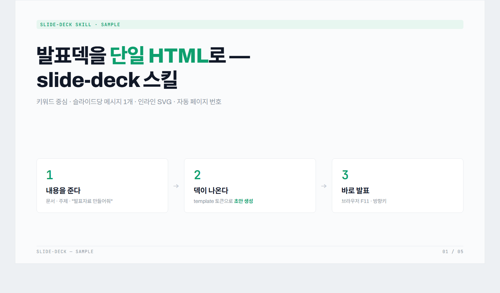
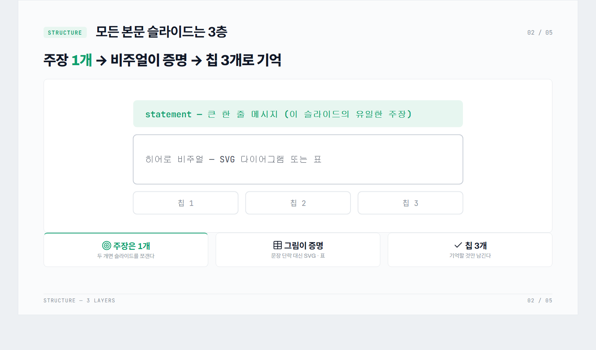
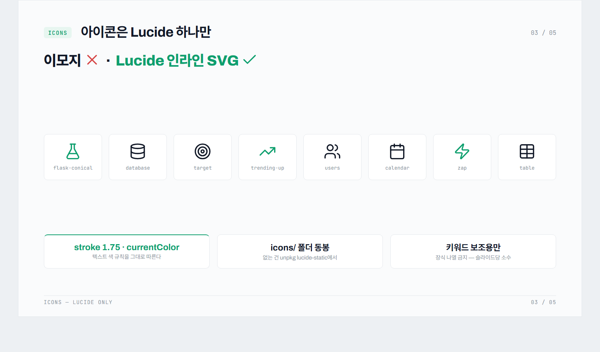
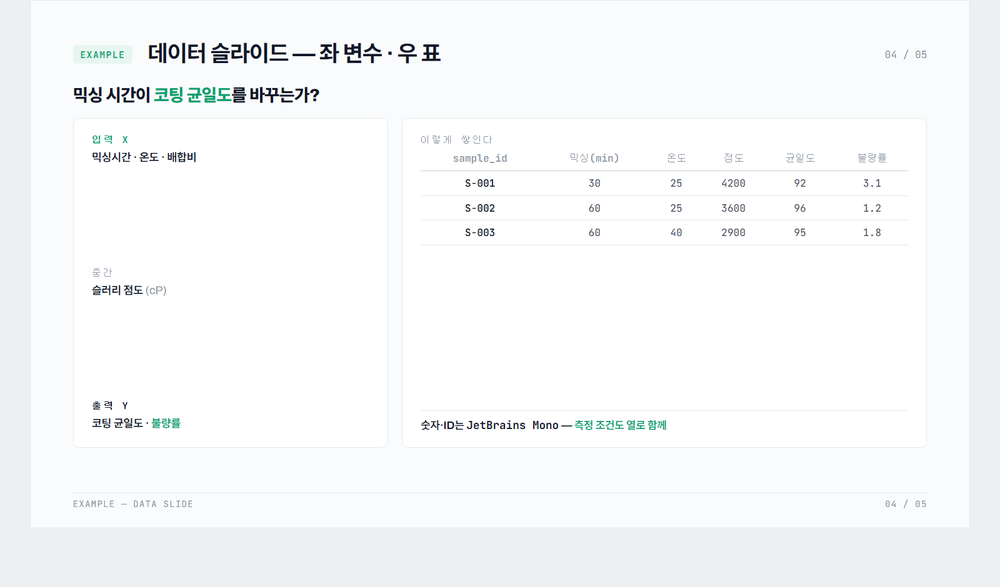

# slide-deck — Traction Dashboard 스타일 발표덱 제작 스킬

[Claude Code](https://claude.com/claude-code)용 스킬. 단일 HTML 파일로 된 16:9 발표 슬라이드 덱을 만든다 — 밝은 대시보드 무드, 키워드 중심, 인라인 SVG 비주얼, 자동 페이지 번호.

A Claude Code skill that generates presentation decks as a single self-contained HTML file — light dashboard mood, keyword-first slides, inline SVG visuals, auto page numbering.

## 특징

- **Traction Dashboard 스타일**: 연회색 배경(`#FAFBFC`) 위 흰색 카드 그리드, 데이터 그린(`#0E9F6E`) 포인트, Archivo + JetBrains Mono (+ Pretendard 한글 폴백)
- **슬라이드당 메시지 1개**: `배지+제목 → 큰 한 줄 메시지(statement) → 히어로 비주얼(SVG/표) → 키워드 칩 3개`의 3층 구조
- **강조 3색 체계**: 그린 = 핵심/긍정/허용 · 잉크 볼드 = 보조 · 레드(`#D64545`) = 금지/✗ 전용
- **blocked-path 패턴**: "이건 안 되고(빨간 점선 → ✗) 이렇게 해야 한다(초록 실선 → 도달)"를 그림으로
- **자동 페이지 번호**: 슬라이드를 추가·삭제·이동해도 번호가 어긋나지 않음 (JS 계산)
- **의존성 없음**: 산출물은 HTML 파일 하나. 브라우저에서 열고 F11로 발표 (폰트/KaTeX는 CDN)

## 설치

```bash
# 사용자 레벨 (모든 프로젝트에서 사용)
git clone https://github.com/jayworker/slide-deck-skill "$HOME/.claude/skills/slide-deck"
```

Windows PowerShell:

```powershell
git clone https://github.com/jayworker/slide-deck-skill "$env:USERPROFILE\.claude\skills\slide-deck"
```

## 사용

Claude Code에서:

```
/slide-deck 다음 랩미팅용으로 프로젝트 현황 발표자료 만들어줘
```

또는 자연어로 — "발표자료 만들어줘", "이 문서를 슬라이드로 정리해줘" 등에 자동 매칭된다.

작업 폴더에 [DESIGN.md 스펙](https://github.com/google-labs-code/design.md) 형식의 `design.md`가 있으면 그 토큰을 우선 사용하고, 없으면 내장 Traction 토큰을 쓴다.

## 미리보기

[`examples/sample-deck.html`](examples/sample-deck.html)을 브라우저로 열면 그대로 볼 수 있다.

| | |
|---|---|
|  |  |
|  |  |

스크린샷은 `?only=N` 헬퍼(N번째 슬라이드만 렌더)로 headless Chrome에서 캡처:

```powershell
& "$env:LOCALAPPDATA\Google\Chrome\Application\chrome.exe" --headless=new --hide-scrollbars `
  --window-size=1600,940 --virtual-time-budget=15000 `
  --screenshot="docs\screenshots\slide-1.png" "file:///...\examples\sample-deck.html?only=1"
```

## 아이콘 — Lucide

덱에서 아이콘이 필요하면 **[Lucide](https://lucide.dev)** (ISC 라이선스)만 쓴다.
자주 쓰는 16종은 [`icons/`](icons/)에 동봉 (stroke 1.75로 조정본), 없는 건
`unpkg.com/lucide-static/icons/<이름>.svg`에서 가져와 **인라인 SVG**로 삽입한다 —
산출물은 단일 HTML로 유지되고, `currentColor`라 그린/레드 강조 규칙을 그대로 따른다.
PPT에 직접 쓸 때도 lucide.dev에서 SVG를 받아 PowerPoint에 삽입하면 색 편집이 된다.

## 구성

| 파일 | 역할 |
|------|------|
| `SKILL.md` | 스킬 정의 — 워크플로, 슬라이드 패턴, 글쓰기/강조/비주얼 규칙 |
| `template.html` | 보일러플레이트 — 디자인 토큰 CSS, 슬라이드 유형별 견본 4장, 자동 번호·`?only=N` 스크립트 |
| `icons/` | 자주 쓰는 Lucide 아이콘 SVG 16종 (stroke 1.75) |
| `examples/sample-deck.html` | 샘플 덱 5장 — 구조·아이콘·데이터 슬라이드 데모 |
| `docs/screenshots/` | 샘플 덱 슬라이드별 PNG (README 미리보기) |

## 크레딧

- 스타일 원형: [SlideSpeak presentation-design-prompts](https://github.com/SlideSpeak/presentation-design-prompts) — traction 테마
- 디자인 토큰 포맷: [google-labs-code/design.md](https://github.com/google-labs-code/design.md)

## License

MIT
